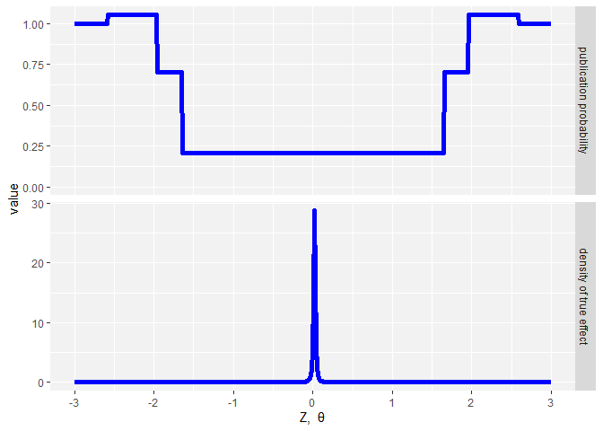

### Overview

This package implements one of the two methods from [Andrews and Kasy (2019)](https://www.aeaweb.org/articles?id=10.1257/aer.20180310) to estimate the degree of publication bias given a meta-study data set that contains estimates and standard errors (typically of reported regression results) from published studies.

The code mainly consists of Maximilan Kasy's code of his shiny app for MetaStudies on publication bias. I slightly modified the interfaces and added some documentation. The original code is here: 

https://github.com/maxkasy/MetaStudiesApp

A crucial (and strong) assumption of the implemented method from Andrews and Kasy (2019) is that in the latent distribution absent publication bias, the estimates and standard errors are statistically independent. This package adds to Maximilian Kasy's original code functions that compute correlations that could indicate possible violations of this assumption. This will be explained further below (see also Kranz and Pütz (2021)).

### Installation

To install the package, run the following code:


```r
options(repos = c(skranz = 'https://skranz.r-universe.dev',
    CRAN = 'https://cloud.r-project.org'))
install.packages('MetaStudies')
```


### Running the app

To run the app with a preloaded example data set just run inside RStudio:


```r
library(MetaStudies)
example.csv = system.file("data/IV.csv", package="MetaStudies")
MetaStudiesApp(example.csv, show.cor=TRUE)
```

You could also put the the code above into an `app.R` file to specify it as a app for Shiny server.

If you want to run the app in Maximilan Kasy's original version (without pre-loaded file and no tab for correlations) just type:


```r
library(MetaStudies)
MetaStudiesApp(show.cor=FALSE)
```

### Using the package without the shiny app

One can also use the relevant functions of the package directly without starting the shiny app.


```r
example.csv = system.file("data/IV.csv", package="MetaStudies")
dat = read.csv(example.csv,header = FALSE)
colnames(dat) = c("X","sigma")
head(dat)
```

```
##         X  sigma
## 1  98.592 72.412
## 2 124.907 36.827
## 3   1.070  0.290
## 4  91.604 25.373
## 5   2.150  0.810
## 6   1.050  0.270
```

This is an example data set extracted from the supplemental data of the meta study by [Brodeur et al. (2019)](https://www.aeaweb.org/articles?id=10.1257/aer.20190687). It is a subset of their data set containing estimated coefficients and their standard errors from a sample of economic articles that use an instrumental variable (IV) approach to estimate causal effects.

Let us run an analysis with the Andrews and Kasy (2019) method:

```r
ms = metastudies_estimation(X=dat$X,sigma=dat$sigma,model = "t",cutoffs = c(1.645, 1.96, 2.58),symmetric = TRUE)
# Show plot of results
estimates_plot(ms)
```

<!-- -->

The upper plot shows the estimated relative publication probabilities for the different intervals of z-statistics specified by the cutoffs. All publication probabilities are relative to the publication probability given z > 2.58 which is normalized to 1.

The lower plot shows the estimated density of the true z-statistics. We can also get the information as a data frame:


```r
ms$est_tab
```

```
##                          µ           t         df [0, 1.645 ] ( 1.645 , 1.96 ]
## estimate       0.019289521 0.012066501 1.83396754  0.20943948        0.7008920
## standard error 0.003529987 0.002766197 0.04715736  0.01479393        0.0488445
##                ( 1.96 , 2.58 ]
## estimate            1.05342030
## standard error      0.05981187
```

The first 3 columns show the parameters of the generalized t-distribution and the next columns the estimated relative publication probabilities compared to z > 2.58.

The field `dat` contains a data frame that adds as columns the corresponding publication probability `pub.prob` and an index of the interval into which z falls:

```r
head(ms$dat)
```

```
##         X  sigma        z interval.ind  pub.prob
## 1  98.592 72.412 1.361542            1 0.2094395
## 2 124.907 36.827 3.391723            4 1.0000000
## 3   1.070  0.290 3.689655            4 1.0000000
## 4  91.604 25.373 3.610294            4 1.0000000
## 5   2.150  0.810 2.654321            4 1.0000000
## 6   1.050  0.270 3.888889            4 1.0000000
```

## Testing the independence assumption of Andrews and Kasy (2019)

A crucial (and strong) assumption of the implemented method from Andrews and Kasy (2019) is that in the latent distribution absent publication bias, the estimates (`X`) and standard errors (`sigma`) are statistically independent.

Of course, the problem is that we don't observe the latent distribution of `X` and `sigma` absent publication bias but only the resulting distribution distorted by publication bias.

Isaiah Andrews suggested, to weight observations with the inverse of the estimated publication probabilities. Under the null hypothesis that all assumptions of the chosen specification of the Andrews and Kasy (2019) approach are satisfied, this inverse probability weighting allows to recover the correlation in the unobserved latent distribution of tests if no publication bias were present. Let's do that...


```r
dat.log = ms$dat %>%
  filter(X >0, sigma >0) %>%
  mutate(X = log(X), sigma=log(sigma))

cor.ipv = cov.wt(dat.log[,1:2],1/dat.log$pub.prob, cor=TRUE)$cor[1,2]
cor.ipv
```

```
## [1] 0.8782808
```

We see that also the inverse probability weighting approach shows a high correlation between both variables.

The function `metastudy_X_sigma_cors` automatically computes this correlation for log and levels, as well as some additional measures:


```r
metastudy_X_sigma_cors(ms)
```

```
## # A tibble: 2 x 5
##   mode  trans   cor  beta r.sqr
##   <chr> <chr> <dbl> <dbl> <dbl>
## 1 ipv   level 0.909 0.866 0.808
## 2 ipv   log   0.878 0.904 0.840
```

You see the correlations in log and levels and also the coefficient of a linear regression of `sigma` on `X`  and the R-squared of that regression.


Kranz and Pütz (2021) state as intuition for that correlation that a lot of variation in estimated coefficient and standard error is driven by the scaling of the dependent and explanatory variables in the regressions. For example, if we would rescale all explanatory variables in a regression by multiplying them with a factor `1/m`, then the corresponding estimates and standard errors would both change by the factor `m`. This could lead to a strong positive correlation for the log-values even absent publication bias.

### Confidence intervals for the inverse probability weighting approach

Note that correct standard errors and confidence intervals for the inverse probability weighting approach are not trivial to compute since they must also take into account the uncertainty when estimating the publication probabilities. Isaiah Andrews suggested that a GMM approach could yield correct standard errors. However, not being a theoretical econometrician, I don't find it trivial to implement the GMM approach. Luckily, one can sometimes substitute theoretical understanding with brute-force bootstrap computation... 

The function `bootstrap_specification_tests` computes confidence intervals using a bootstrap approach. In each run, we draw a bootstrap sample from the original data, run the Andrews and Kasy approach on the bootstrap sample and then compute the correlation using the estimated publication probabilities. This procedure can be very time consuming and is perhaps better run on a server with multiple cores:


```r
# Takes long to run unless you have a lot of cores
bst = bootstrap_specification_tests(dat$X, dat$sigma, B = 500, num.cores = 2)
```

The resulting object contains a field `sim` that contains raw data of all bootstrap results and a field `sum` that contains summary results.

I have included the bootstrap summary for the example data set in the MetaStudies package: 

```r
sum = readRDS(system.file("data/bootstrap_sum_IV.Rds", package="MetaStudies"))
filter(sum, trans=="log", mode=="ipv") %>%
  select(trans, mode, stat, cor, beta, r.sqr)
```

```
## # A tibble: 4 x 6
## # Groups:   mode [1]
##   trans mode  stat     cor  beta r.sqr
##   <fct> <fct> <chr>  <dbl> <dbl> <dbl>
## 1 log   ipv   ci.low 0.862 0.889 0.825
## 2 log   ipv   ci.up  0.891 0.919 0.855
## 3 log   ipv   mean   0.877 0.904 0.839
## 4 log   ipv   median 0.878 0.903 0.839
```

We see from the rows where `stat` is `ci.low` and `ci.up` that the 95% CI of the correlation `[0.862, 0.891] computed via inverse probability weighting is far away from 0. This suggests that the independence assumption of Andrews and Kasy (2019) seems violated in this example data set.

### References

- Andrews, Isaiah and Maximilian Kasy. 2019. “Identification of and correction for publication bias.” American Economic Review 109 (8): 2766-94.

- Brodeur, Abel, Nikolai Cook, and Anthony Heyes. 2020. “Methods Matter: p-Hacking and Publication Bias in Causal Analysis in Economics.” American Economic Review, 110 (11): 3634-60.

- Kranz, Sebastian and Peter Pütz. 2021 “Rounding and other pitfalls in meta-studies on p-hacking and publication bias. A comment on Brodeur et al. (2020)”, working paper.
